## Loops Exercise

    To run the promtable solution uncomment the respective file script from this html fle

[HTML File](./loops.html)

1.  Create a program that outputs all odd, positive numbers less than 100, starting from 1, such as 1, 3, 5, 7, 9, 11, and so on.

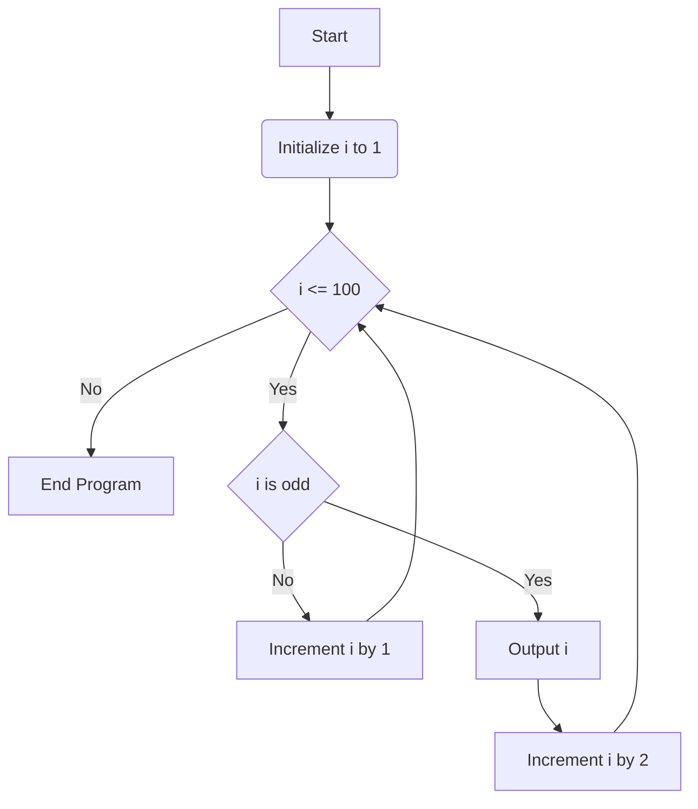

2.  Develop a program that outputs all even, positive numbers less than 100 in the following pattern: 2, 98, 4, 96, 6, 94, and so on, up to the last number before 100. Display the result in a single line.

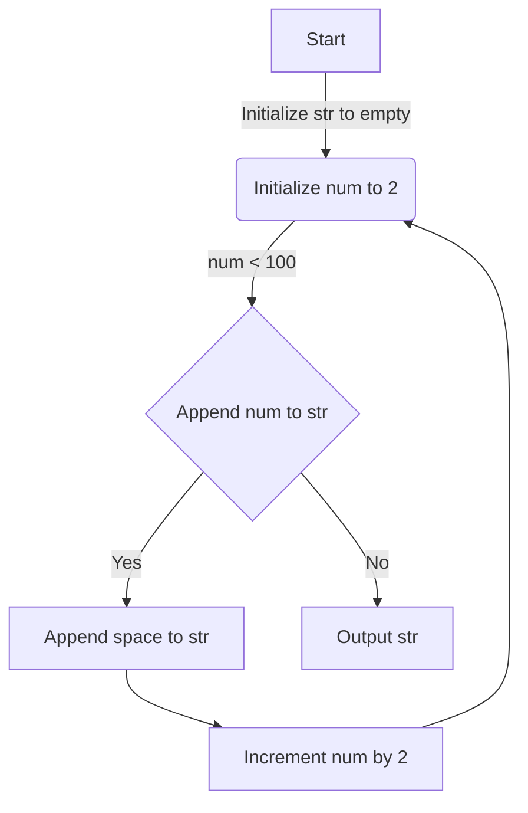

3.  Create a program that continuously prompts the user to input distance (in kilometers) and time (in hours) and then calculates the average speed. The program should terminate when the user enters 0 for the distance. Upon receiving a distance of 0, the program should not prompt for any further input.

- solution 1.0.0

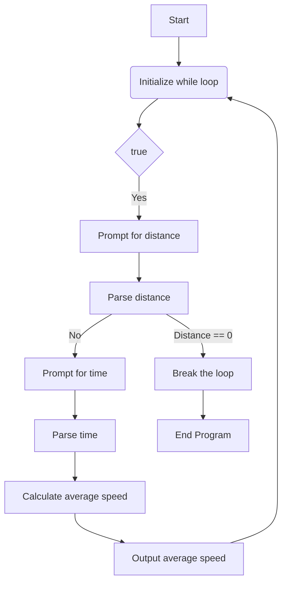

##

- solution 1.0.1

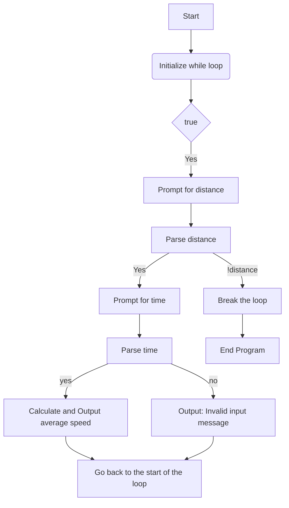

##

- solution 1.0.2

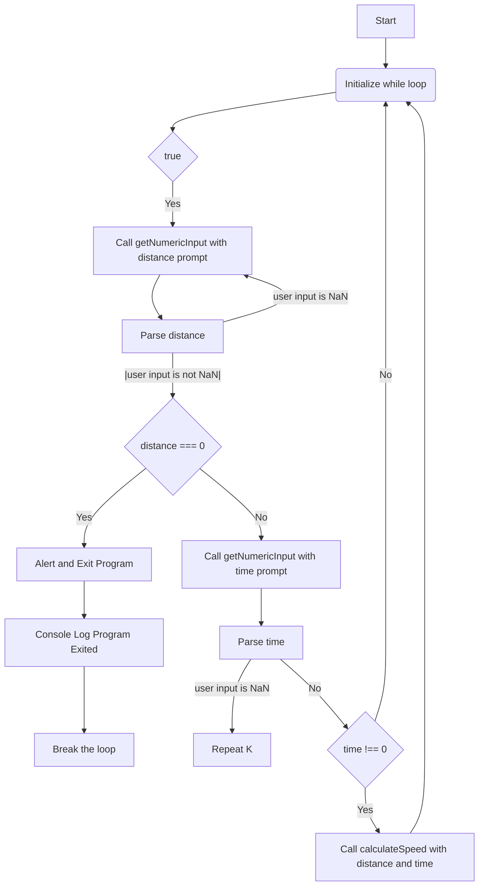

##

-

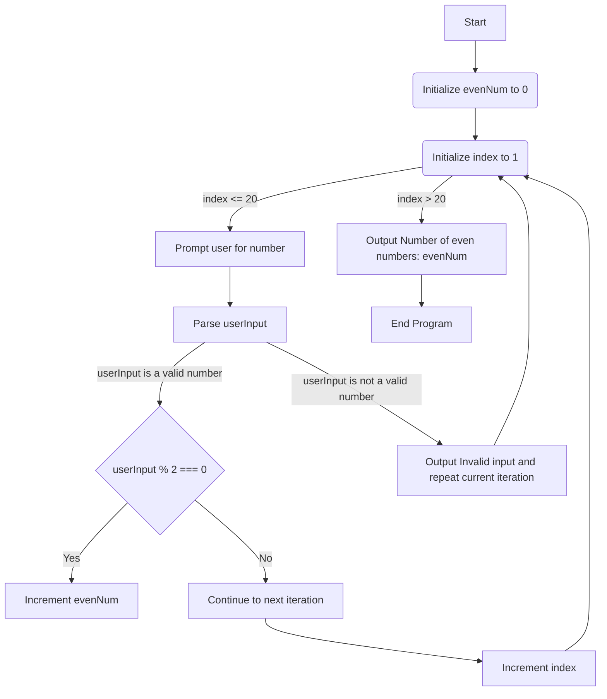

##

4. Develop a program that requests the user to input 20 numbers. After all numbers are entered, the program should display how many of these numbers are even.

-

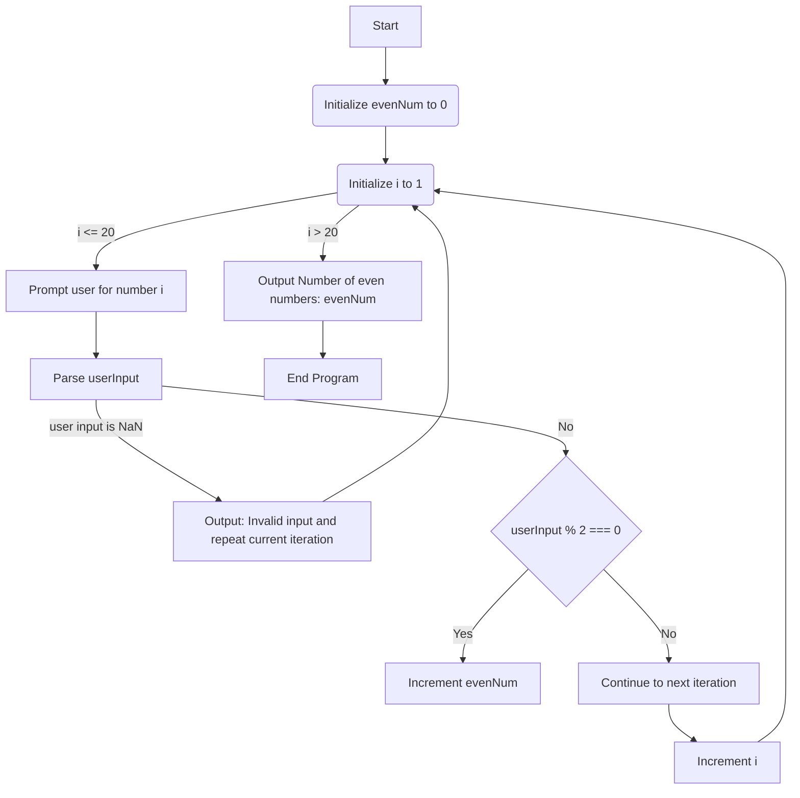

##

5.  Develop a program that continuously prompts the user to input numbers until the user enters 0, at which point the program terminates. After termination, the program should calculate and display the average of all the entered numbers.

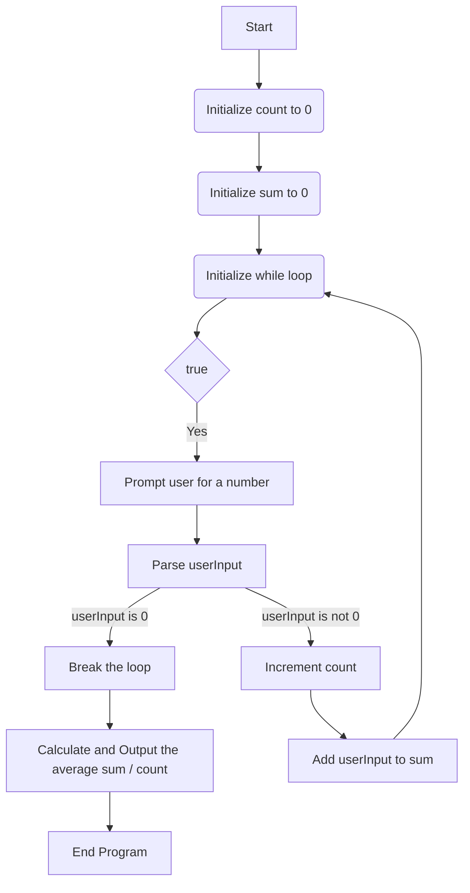

##

6.  Develop a program that initially asks the user for a single number. Following this, the program should inquire if the user wishes to continue providing numbers with the prompt: 'Do you want to continue giving numbers? (y/n)'. If the user responds with 'y', the program will request another number. If the response is 'n', the program terminates. Upon termination, it calculates and displays the average of all entered numbers.

-

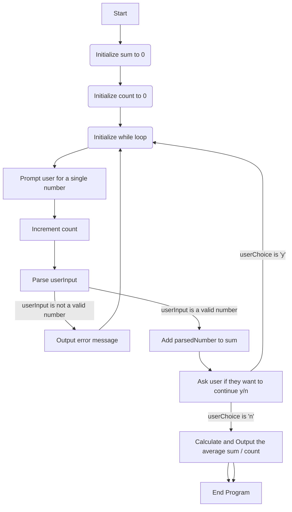

##

7.  Not assigned

8.  Develop a program that initially asks the user how many numbers they wish to input. After receiving this information, the program should then prompt the user to enter each of these numbers. Once all numbers have been entered, the program should determine and display the smallest and biggest number provided by the user.

- For loops

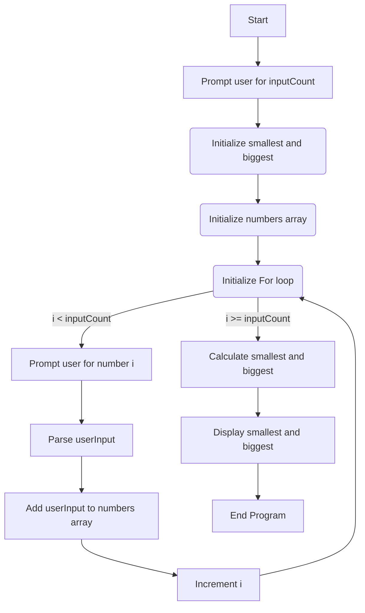

##

- With while loop

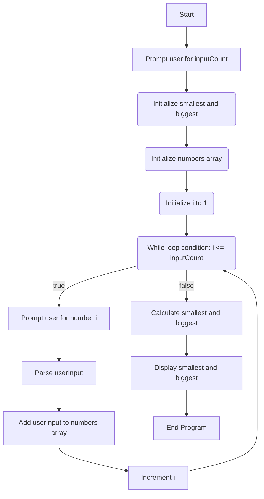

# EOP
